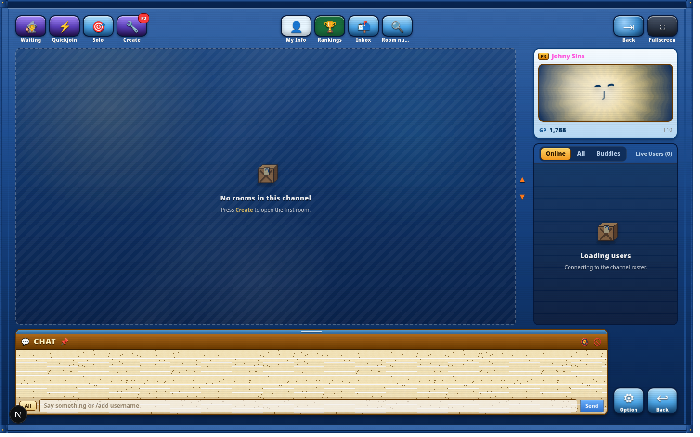
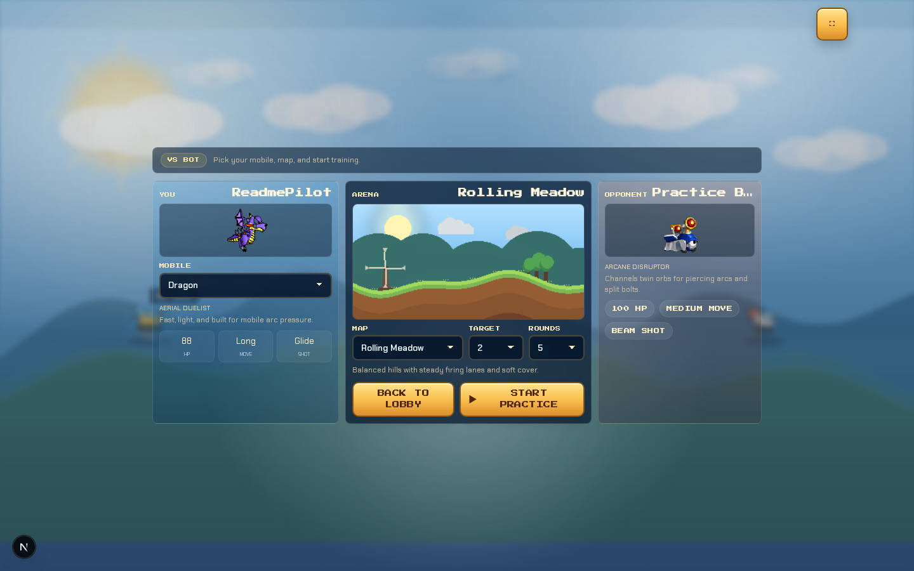
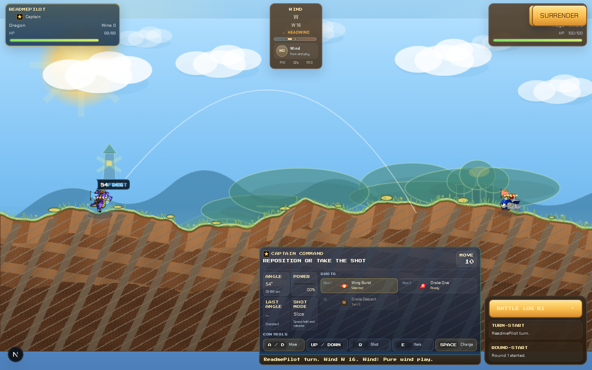
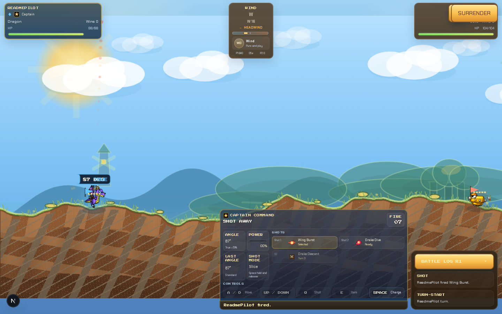

# Rembound


Turn-based artillery in the spirit of the Softnyx original. Two players pick a mobile, set angle and power, account for wind, and fire. Terrain deforms on impact, turns alternate, and the round ends when someone's HP hits zero. Eleven mobiles with distinct weapons and mechanics: bouncing shells, burrowing drills, twin explosions, orbital strikes.

Rooms can be played out in one sitting or picked up hours later, the game state persists and resumes where it left off. Between matches you are in a shared lobby where you can see who is online, browse open rooms, challenge anyone directly, add friends, and chat. It is less a strict 1v1 matchmaker and more a social space where games happen organically. Rounds award XP and your level is tracked on your profile.

## Gameplay Preview

The clip starts on an actual turn, not the app boot sequence.

<video controls poster="docs/screenshots/battle-hud.png" width="100%">
  <source src="docs/media/gameplay-preview.mp4" type="video/mp4">
  <source src="docs/media/gameplay-preview.webm" type="video/webm">
</video>

[Watch the gameplay preview](docs/media/gameplay-preview.mp4)

- Turn-based artillery with wind, angle, and power control.
- Terrain deformation and impact effects after each shot.
- Solo practice against a bot for quick tuning.
- Shared lobby for rooms, chat, friends, invites, quickjoin, and rankings.
- Persistent room and round state through SpacetimeDB.
- Different mobiles with different projectile behavior, from bounce shots to burrowing drills and twin explosions.

## Battle Loop

Pick a mobile, set the shot, and read the wind. The round ends when a mobile hits zero HP, while the HUD keeps the active turn, weapon, angle, power, and battle log visible.

Outside the match, the lobby is where players wait, swap rooms, send invites, and start solo practice or local duels.

## Screenshots

| Lobby | Solo practice |
|---|---|
|  |  |

| Battle HUD | Projectile action |
|---|---|
|  |  |

## Mobiles

| Mobile | Role | Notes |
|---|---|---|
| Armor | Frontline Tank | Heavy shell, low arc |
| Knight | Precision Skirmisher | Bounce secondary |
| Dragon | Aerial Duelist | Wind-sensitive, high speed |
| Snow | Siege Carrier | Wide blasts, heavy shells |
| Trico | Horned Artillery | Dragon-tuned with ricochet secondary |
| Aduka | Lightning Control | High wind sensitivity, strong secondary arcs |
| Mage | Arcane Disruptor | Primary arcs; secondary splits into twin explosion |
| Nak | Burrowing Skirmisher | Primary drills underground on first contact |
| Turtle | Bulwark Cannoneer | High HP, limited movement |
| Frog | Bouncing Bombardier | Both weapons bounce and deal impact damage at each point |
| A.Sate | Recon Submersible | Mid-weight, wide blasts |

## Development

```bash
bun install
bun run dev
```

`bun run dev` launches a fullscreen TUI process manager (`scripts/dev.ts`) with three panels:

| Panel | What it does | Auto-starts |
|---|---|---|
| `1` Next.js | Frontend dev server | yes |
| `2` SpacetimeDB | Local DB server on `:3002` | yes |
| `3` STDB Module | Builds Rust module, watches, emits TS bindings | no (press `s`) |

The TUI auto-starts Next.js and the local SpacetimeDB server. Switch to panel `3` and press `s` to build and watch the Rust module for multiplayer. TypeScript bindings are regenerated automatically on module changes.

### Prerequisites

- [Bun](https://bun.sh) >= 1.2
- [SpacetimeDB CLI](https://spacetimedb.com/docs) (`spacetime`)
- Rust toolchain to compile the server module

### Environment

```bash
cp .env .env.local
# fill in NEXT_PUBLIC_SPACETIMEDB_URI and any other keys
```

### Dev TUI Controls

| Key | Action |
|---|---|
| `1` / `2` / `3` or Tab | Switch panel |
| `s` | Start selected process |
| `k` | Kill selected process |
| `r` | Restart selected process |
| `a` | Start all auto-start processes |
| `o` | Open URL in browser |
| `Up` / `Down` | Scroll log |
| `g` | Jump to bottom |
| `q` | Quit and kill all processes |

## Tech Stack

| Layer | Tech |
|---|---|
| Frontend | Next.js 15 / React 19, custom CSS per feature |
| Backend + Database | SpacetimeDB, Rust module, generated TypeScript client |
| Rendering | HTML Canvas |
| Game state | Zustand for local simulation |
| Auth | Custom credential table in SpacetimeDB with client-side token storage |

## SpacetimeDB

SpacetimeDB replaces a traditional backend plus database with a single Rust module. Tables are defined in Rust and reducers run transactionally. The TypeScript client subscribes to table changes in real time, without a REST layer or polling.

For this project the module handles:

- Player registration and credential storage.
- Room lifecycle: create, join, leave, settings, invites.
- Matchmaking queue.
- Round and turn tracking, round events, and stats.
- Lobby and room chat.
- Friends and friend requests.

The TypeScript bindings in `src/features/game/spacetime/module_bindings/` are generated from the Rust source and should never be edited manually. Run `bun run spacetime:generate` to regenerate them.

**Schema tables:** `player`, `credential`, `room`, `room_member`, `round`, `round_event`, `round_stat`, `chat_message`, `lobby_chat_message`, `friendship`, `friend_request`, `room_invite`, `waiting_player`, `app_setting`.

### SpacetimeDB Commands

```bash
bun run spacetime:build                # Compile the Rust module
bun run spacetime:dev                  # Build + watch + regenerate TS bindings
bun run spacetime:dev:reset            # Same, but wipes data on conflict
bun run spacetime:generate             # Regenerate TS bindings only
bun run spacetime:start                # Start local SpacetimeDB on :3002
bun run spacetime:publish              # Publish module to cloud
bun run spacetime:publish:local        # Publish to local server
bun run spacetime:publish:local:reset  # Publish local, clearing existing data
bun run spacetime:logs                 # Tail module logs
```

## Project Structure

```text
src/
  app/                      # Next.js routes and global CSS
  components/               # Shared components
  features/
    auth/                   # Auth flow, credential table, token cipher, themes
    game/                   # Canvas engine, physics, mobiles, weapons, SpacetimeDB hooks
      engine/               # Terrain, gravity, collision, projectile, rounds, wind
      spacetime/            # SpacetimeDB provider, hooks, generated module_bindings/
    intro/                  # Animated logo intro sequence
    lobby/                  # Rooms, chat, friends, leaderboard, matchmaking queue
  lib/
  shared/
server/
  spacetimedb/              # Rust SpacetimeDB module
scripts/
  dev.ts                    # TUI process manager
  prepare-mobile-asset.py   # Sprite sheet preparation tool
```

## Tests

```bash
bun run test:e2e          # Playwright, headless
bun run test:e2e:ui       # Playwright UI mode
bun run test:e2e:debug    # Debug spec
bun run test:e2e:update   # Update snapshots
```

## Asset Pipeline

Mobile sprite sheets are processed via `scripts/prepare-mobile-asset.py`, which generates 64x64 4-frame atlases from high-res source sheets.

```bash
bun run prepare-mobile-asset
```

## License

Personal project, not affiliated with IMC Networks or the original GunBound.
